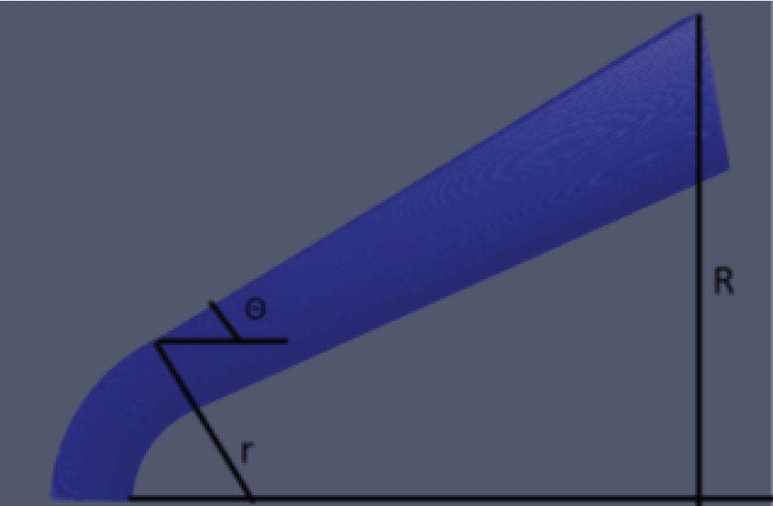
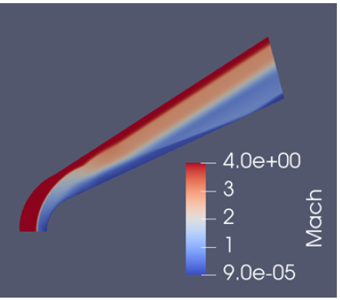
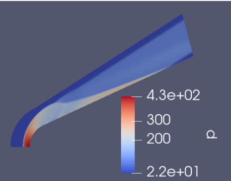
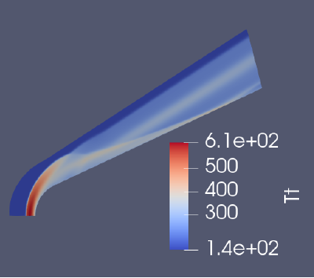
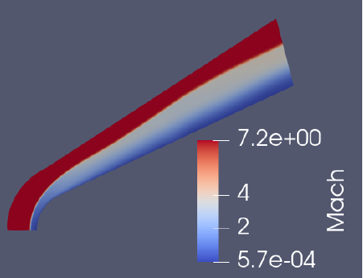
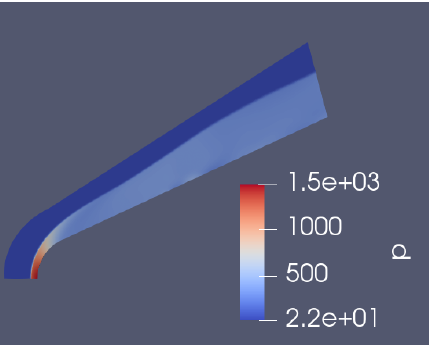
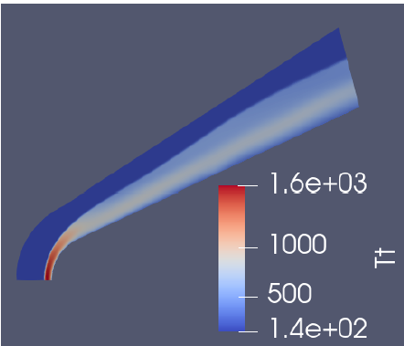
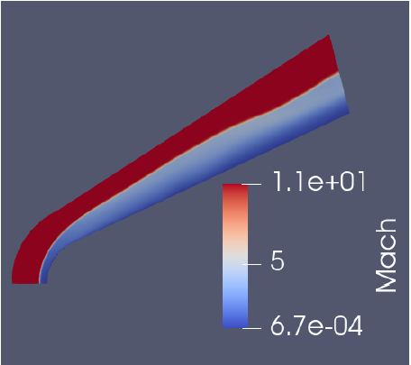
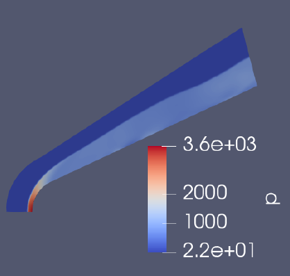
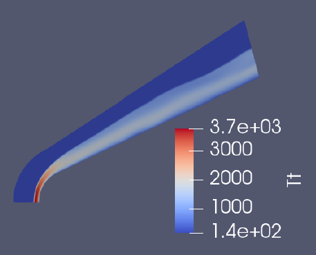

# Hypersonic Blunt Cone Simulation (OpenFOAM + Hy2Foam)

This repository contains numerical simulations of **supersonic and hypersonic flow over a spherically blunted cone** at Mach **4**, **7.2**, and **11.3**.  
Simulations were performed in **OpenFOAM** using the **Hy2Foam** solver, and results were compared with analytical shock theory.

The repository includes:

- Complete case directories (`mach_4/`, `mach_7.2/`, `mach_11.3/`)
- Flow-field visualizations (`images/`)
- Analytical vs numerical comparison tables
- Discussion and conclusions

---

## 1. Geometry & Mesh

The computational domain consists of a **25° blunted cone** with:

| Parameter       | Value                                 |
| --------------- | ------------------------------------- |
| Nose radius, r  | **0.635 cm** (0.00635 m)              |
| Base radius, R  | **2.3 cm**                            |
| Ratio r/R       | **0.276**                             |
| Cone half-angle | **25°**                               |
| Mesh resolution | **600 × 200** structured              |
| Mesh spacing    | 0.002 mm near wall → 0.01 mm at inlet |

Mesh image:  
`

---

## 2. Flow Conditions & Physical Model

Simulations assume **air (nitrogen)** as a perfect gas.

| Property                | Value                |
| ----------------------- | -------------------- |
| Free-stream pressure    | **21.9139 Pa**       |
| Free-stream density     | **5.1 × 10⁻⁴ kg/m³** |
| Free-stream temperature | **144.4 K**          |
| Speed of sound          | **244.64 m/s**       |
| Mean free path          | **1.01 × 10⁻⁴ m**    |
| Knudsen number          | **0.002**            |
| Wall temperature        | **297.2 K**          |
| γ (specific heat ratio) | **1.4**              |

Assumptions in the analytical model:

- Inviscid, perfect gas
- No chemical reactions
- Shock treated as a discontinuity

Hy2Foam was used for multi-temperature hypersonic modeling.

---

## 3. Simulation Cases

| Case      | Mach | Free-stream Velocity (m/s) |
| --------- | ---- | -------------------------- |
| Mach 4    | 4.0  | 978.58                     |
| Mach 7.2  | 7.2  | 1760                       |
| Mach 11.3 | 11.3 | 2764.5                     |

Each directory contains a complete OpenFOAM setup.

---

## 4. Analytical vs Numerical Comparison

### 4.1 Shock Stand-off Distance

| Mach | Analytical (m) | Numerical (m) | Error (m) |
| ---- | -------------- | ------------- | --------- |
| 4.0  | 0.0098         | 0.0100        | 0.0002    |
| 7.2  | 0.0087         | 0.0089        | 0.0002    |
| 11.3 | 0.0086         | 0.0088        | 0.0002    |

---

### 4.2 Weak Shock Region (Supersonic Downstream)

| Mach | Analytical M₂ | Numerical M₂ | Difference |
| ---- | ------------- | ------------ | ---------- |
| 4.0  | 2.21          | 2.6          | +0.39      |
| 7.2  | 3.03          | 3.3          | +0.27      |
| 11.3 | 3.46          | 3.66         | +0.20      |

---

### 4.3 Strong Shock Region (Subsonic Downstream)

| Mach | Analytical M₂ | Numerical M₂ | Difference |
| ---- | ------------- | ------------ | ---------- |
| 4.0  | 0.50          | 0.70         | +0.20      |
| 7.2  | 0.48          | 0.60         | +0.12      |
| 11.3 | 0.4768        | 0.49         | +0.013     |

---

### 4.4 Normal Shock Region (Centerline)

#### Mach Number

| Mach | Analytical M₂ | Numerical M₂ | Difference |
| ---- | ------------- | ------------ | ---------- |
| 4.0  | 0.435         | 0.500        | +0.065     |
| 7.2  | 0.3974        | 0.3500       | –0.047     |
| 11.3 | 0.3859        | 0.3400       | –0.046     |

#### Temperature

| Mach | Analytical T₂ (K) | Numerical T₂ (K) | Difference |
| ---- | ----------------- | ---------------- | ---------- |
| 4.0  | 584.4             | 610              | +25.6      |
| 7.2  | 1591.3            | 1600             | +8.7       |
| 11.3 | 3537.8            | 3700             | +162.2     |

---

## 5. Flow Visualizations

### Mach 4

**Mach Number**  


**Pressure**  


**Temperature**  


### Mach 7.2

**Mach Number**  


**Pressure**  


**Temperature**  


### Mach 11.3

**Mach Number**  


**Pressure**  


**Temperature**  


---

## 6. Discussion

Key observations:

1. **Weak shock region has the largest error**  
   Up to 0.4 Mach difference due to shock curvature sensitivity and shock-angle variations.

2. **Strong shock region accuracy improves with Mach**  
   At Mach 11.3, values nearly match analytical predictions.

3. **Normal shock predictions are accurate**  
   Errors remain below 0.07 in Mach number.

4. **Temperature predictions match well**  
   Even at high enthalpy, numerical and analytical results agree closely.

5. **Shock stand-off distance error is consistent**  
   A fixed offset of 0.0002 m suggests limited mesh refinement and convergence time.

---

## 7. Conclusion

- The blunted cone produced the expected detached bow shock across all Mach numbers.
- Numerical results match analytical shock theory closely, especially in strong and normal shock regimes.
- Weak shock discrepancies arise due to shock curvature and mesh sensitivity.
- Temperatures and stand-off distances are predicted accurately.
- Hy2Foam + OpenFOAM is validated as a robust tool for hypersonic flow simulation.

This dataset is suitable for further study on hypersonic aerothermodynamics, validation, and CFD method development.

---

## 8. How to Run the Cases

```bash
cd mach_11.3
blockMesh
# Optional parallel:
# decomposePar
# mpirun -np <N> hy2Foam -parallel
# reconstructPar
postProcess
foamToVTK
```
